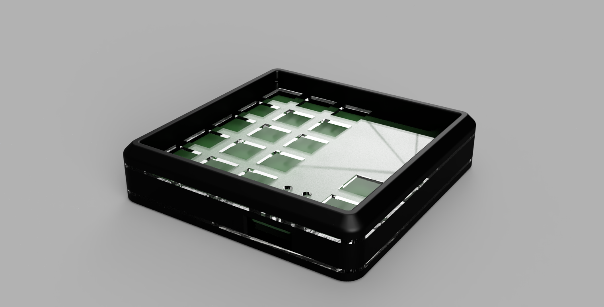
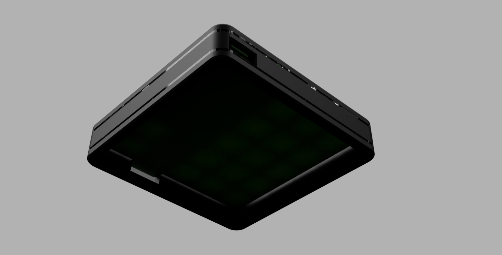

# Frankenduck
This project is a hardware rework of dekuNukem's duckypad project.
I liked the whole promise of the project, but the lack of protection for it in a more EDC style role was a bit off putting.
So because I had to read up into Altium for my job, I made it a goal for myself to redo the pcb.
I'm, in addition of that,  making a 3dprinted body for it to house everything.

## Original project

The original project where I took the schematic from (and probably gonna implement his very all-encompassing software package from):  
[dekuNukems duckypad project](https://github.com/dekuNukem/duckyPad) and
[the schematic in question ](https://github.com/dekuNukem/duckyPad/blob/master/pcb/lul.sch).  
You can view the original schematic easily with Eagle or by importing the file to [a site like this](https://www.altium.com/viewer/).

Also go take a look at the [official duckyPad Discord](https://discord.gg/4sJCBx5). 
The original designer and I are both active there.

## Overview

My goal with the hardware redesign is a more rigid and portable design while still being stylish and usable.
By implementing the top and bottom switch plate in acrylic I'm able to keep the pcb and amoled screen visible and protected.
The acrylic also gives a nice effect on the sides where the light can seep through through the side of the body.

### pcb design

The schematic is exactly the same, other than the 2 layer selection switches now being actual mechanical switches.
I worked in Altium, so I still need to find a way to export the the project to easier accessible formats for other programs.

Now I'm waiting on parts to build a prototype, I recieved most of it but some parts are still being shipped.

